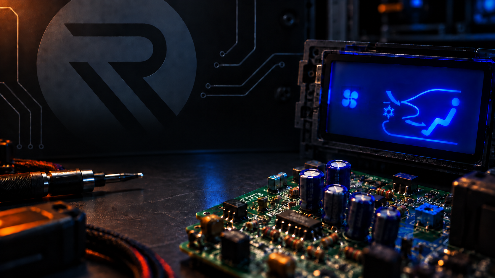

# Reforge Beta

  

Reforge is a Windows desktop application for creating, managing, and uploading display templates for supported Mitsubishi 3000GT and Dodge Stealth digital climate-control display replacements.

> [!WARNING]
> Reforge is currently beta software. Bugs, incomplete behavior, and unexpected results are possible. Review your work before uploading it to a device and report app problems through the project’s bug form.

## Current Status

The public beta has not been released yet. After the initial build completes review, official installers will be available from [GitHub Releases](https://github.com/gonzoinc/reforge/releases).

This repository is the public home for:

- Official compiled Reforge beta downloads.
- End-user information and release notes.
- App bug reports and issue tracking.
- License, notices, and branding terms.

Application source code, firmware source code, hardware designs, PCB files, manufacturing files, and private development material are **not published in this repository**.

## System Requirements

- Windows 10 or Windows 11, 64-bit.
- A supported Reforge display is required only for device connection and upload features.
- The installer includes the required .NET desktop runtime; a separate .NET installation is not required.

## Downloading Reforge

When a beta is available:

1. Open [Releases](https://github.com/gonzoinc/reforge/releases).
2. Choose the newest release marked **Pre-release**.
3. Download the Windows installer attached to that release.
4. Compare the installer’s SHA-256 hash with the published checksum before running it.

## Installing the Unsigned Beta on Windows

Reforge beta installers are not currently code-signed. On some Windows systems, Microsoft Defender SmartScreen blocks the installer completely and does not offer a **More info** or **Run anyway** option. In that case, SmartScreen's app check must be disabled temporarily before the installer can run.

Before changing SmartScreen:

1. Confirm that the installer came from this repository's [official Releases page](https://github.com/gonzoinc/reforge/releases).
2. Compare the downloaded installer's SHA-256 hash with the checksum published beside that release.
3. Do not continue if the filename or checksum does not match.

To install when SmartScreen blocks the file:

1. Open **Windows Security** from the Windows Start menu.
2. Select **App & browser control**.
3. Select **Reputation-based protection settings**.
4. Turn **Check apps and files** off. Approve the Windows confirmation prompt if one appears.
5. Run the Reforge installer again.
6. Windows will still display a confirmation warning because the installer has an unknown publisher. Select the affirmative option—such as **Yes**, **Run**, or **Proceed**—to continue the installation.
7. As soon as installation finishes, return to **Windows Security → App & browser control → Reputation-based protection settings** and turn **Check apps and files** back on.

> [!IMPORTANT]
> Disable only **Check apps and files**, only for the time needed to install the verified Reforge download, and re-enable it immediately afterward. Do not disable antivirus protection or other Windows Security features. If a work or school administrator controls this setting, contact that administrator instead of bypassing the policy.

See Microsoft's [App & browser control documentation](https://support.microsoft.com/en-us/windows/app-browser-control-in-the-windows-security-app-8f68fb65-ebb4-3cfb-4bd7-2a32ea6bd946) for additional information about SmartScreen and reputation-based protection.

## Reporting an App Bug

Use the [Reforge app bug form](https://github.com/gonzoinc/reforge/issues/new?template=bug-report.yml). The form asks for the app version, affected area, Windows version, steps to reproduce the problem, and any useful screenshots or logs.

Before filing a report:

- Check [existing issues](https://github.com/gonzoinc/reforge/issues) for the same problem.
- Remove passwords, access tokens, private keys, personal information, and other secrets from screenshots or logs.
- Report only Reforge desktop-app problems here. Firmware, hardware, wiring, installation, and vehicle issues are outside this repository’s current bug-tracking scope.

The app’s yellow bug button opens the repository’s Issues page in the default web browser.

## License

Official Reforge beta binaries are licensed for personal, educational, repair, hobby, research, and other noncommercial use under the [PolyForm Noncommercial License 1.0.0](LICENSE.md), subject to the required notices in that file.

Commercial use is not included. See [Commercial Licensing](COMMERCIAL-LICENSE.md) for examples and additional information.

The license does not grant access to or rights in unpublished source code, firmware source, hardware designs, PCB files, manufacturing data, trademarks, logos, or branding.

## Legal And Project Documents

- [Software License](LICENSE.md)
- [Notices](NOTICE.md)
- [Commercial Licensing](COMMERCIAL-LICENSE.md)
- [Bug Reports and Contributions](CONTRIBUTING.md)
- [Security Policy](SECURITY.md)
- [Trademarks and Branding](TRADEMARKS.md)

## Independence Notice

Reforge is an independent project and is not affiliated with, sponsored by, or endorsed by Mitsubishi, Dodge, Stellantis, or any related trademark holder. Third-party names are used only to identify compatibility and source-hardware context.
